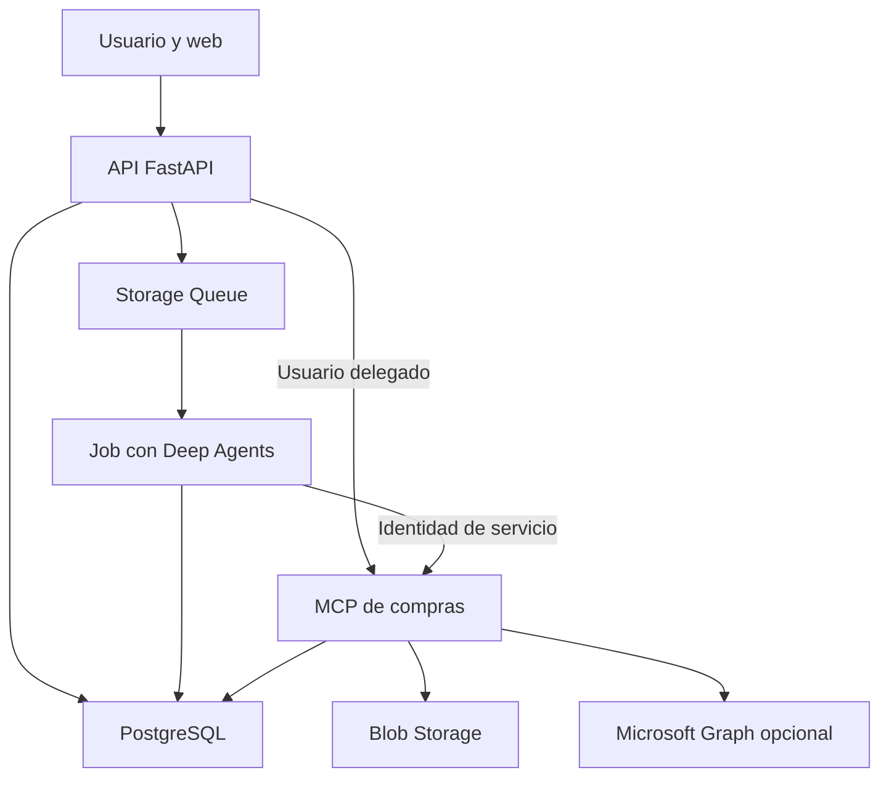

# Plan de portfolio: Procurement Agent Workbench

Fecha de referencia: 1 de octubre de 2026. Revisión 2: compras, PostgreSQL y demo efímera. Estado: propuesta de arquitectura y backlog; no se ha desplegado infraestructura ni modificado un repositorio.

## 1. Objetivo y decisiones acordadas

Construir **Procurement Agent Workbench**, un asistente de compras técnicas y gestión de proveedores con Deep Agents. El proyecto demostrará identidad de usuario y de servicio, MCP propio, planificación, pausas duraderas, skills, evaluaciones e infraestructura reproducible.

Revisión del 1 de octubre de 2026: el usuario elige el caso de compras, prefiere PostgreSQL y prioriza desarrollar localmente, desplegar una demo en Azure y eliminar después sus recursos. Esta versión sustituye la propuesta anterior de Cosmos DB y revisión de recursos Azure.

Stack: Python, FastAPI, Deep Agents/LangGraph, MCP propio, PostgreSQL, Blob Storage, Storage Queues, Key Vault, Entra ID, UAMIs, Terraform, GitHub Actions y Langfuse. El SDK de agentes se ejecuta en contenedores propios. [S1]

Tres modos: desarrollo local económico; demo Azure temporal con identidades reales; integración opcional con Microsoft Graph si hay una cuenta compatible disponible. No se presupone una licencia de Microsoft 365 ni un sandbox gratuito.

El objetivo económico pasa a ser coste por sesión de demo, no mantener una plataforma encendida todo el mes. No se exige conservar ningún workload Azure entre sesiones. El código, dataset sintético, skills y resultados seleccionados se conservan fuera del entorno que se elimina.

## 2. Caso de uso y recorrido de demostración

Solicitud de ejemplo: «Necesitamos renovar los equipos del laboratorio. Compara las ofertas, comprueba qué podemos reutilizar y prepara una solicitud. Pregunta por lo que falte y espera mi aprobación antes de tramitarla».

1. El usuario entra con Entra y selecciona un proyecto al que tiene acceso.
2. El agente identifica requisitos pendientes, propone un plan y pregunta por presupuesto o especificaciones imprescindibles.
3. Consulta inventario y políticas; obtiene ofertas de documentos cargados o, en el perfil conectado, de la cuenta Microsoft del usuario.
4. Extrae conceptos de ofertas PDF/XLSX y usa código determinista para calcular importes, impuestos y transporte.
5. Detecta una oferta incompleta y prepara una petición de aclaración. La acción de envío necesita aprobación.
6. Espera una respuesta. En el escenario reproducible, la respuesta se incorpora mediante la aplicación; en el perfil conectado, mediante integración externa.
7. Actualiza la comparativa con evidencias y justifica la propuesta.
8. Genera un informe y una solicitud de compra en PostgreSQL. Se interrumpe hasta que un usuario con rol apropiado decide.
9. Tras aprobación, registra la tramitación y publica el artefacto. Los reintentos no duplican la operación.
10. Una corrección sobre cómo valorar las ofertas produce una propuesta de skill; su promoción requiere evaluación y revisión.

El MVP no efectúa pagos ni contrata con proveedores reales. Sí modifica datos, gestiona solicitudes y genera documentos reales dentro de la aplicación. Los datos de proveedores son sintéticos y están identificados como tales.

La demo de menor coste no finge haber enviado un correo real: la acción genera una salida en la bandeja de demo. El perfil Graph utiliza la API real y muestra explícitamente ese modo.

## 3. Arquitectura local y Azure

Entra emite tokens; Key Vault almacena los secretos necesarios; el worker llama al modelo y todos los servicios emiten telemetría. Las UAMIs se asignan por workload.

| Elemento | Desarrollo local | Demo Azure |
|---|---|---|
| API/web | FastAPI y estáticos | Container App Consumption, mínimo 0 |
| Worker | Proceso o contenedor local | Container Apps Job activado por cola |
| MCP | Servicio local | Container App Consumption, ingress interno |
| Base de datos | PostgreSQL en Docker | Azure Database for PostgreSQL Flexible Server, Burstable pequeño, sin HA |
| Archivos y cola | Azurite o adaptadores locales | Blob Storage y Storage Queue |
| Identidad | Identidad de desarrollo; Entra para pruebas reales | Entra y UAMIs con permisos mínimos |
| Secretos | Configuración local fuera de Git | Key Vault Standard |
| Modelos | Modelo económico; respuestas simuladas para tests | Endpoint Azure con pago por uso |
| Imágenes | Docker local / GHCR | GHCR público, imágenes inmutables |
| Observabilidad | Logs estructurados y Langfuse opcional | Langfuse Cloud Hobby y logs acotados |

El modo local comparte lógica de dominio, esquemas y contratos. No reproduce UAMIs: esas pruebas se realizan en Azure. [S5]

Los Jobs finalizan al interrumpirse el agente; no consumen cómputo mientras esperan una respuesta humana. El proceso de aplicación consume y confirma los mensajes: el scaler no sustituye ese trabajo. [S7, S8]

Elegir una región con disponibilidad y cuota. Evitar de entrada NAT Gateway, Private Endpoints, HA, reservas y servicios con coste fijo innecesario. PostgreSQL exige TLS y configuración de red/firewall; Storage y HTTP exigen HTTPS. La conexión privada se puede añadir como experimento temporal con su coste separado.

## 4. Diseño de los agentes

Empezar con un agente principal y añadir dos especialistas cuando exista una tarea que justifique delegar:

| Agente | Trabajo | Herramientas admitidas |
|---|---|---|
| Principal | Entender la petición, planificar, coordinar y pedir aclaraciones | Lecturas permitidas, delegación, preguntas y preparación de acciones |
| Analista | Contrastar ofertas, inventario y política de compras | Lectura y análisis; sin publicación |
| Redactor | Redactar comparativa y solicitud con evidencias | Lectura de evidencias y escritura de borrador |

Los subagentes comparten inicialmente el mismo proceso. Sus listas de herramientas reducen la superficie de uso, pero **no constituyen aislamiento de identidad de Azure**. Si se quiere demostrar una UAMI distinta por agente con separación fuerte, debe ejecutarse cada uno en un workload separado y asignarle únicamente su identidad.

Configurar explícitamente planificación, límite de iteraciones, número de delegaciones, máximo de herramientas y presupuesto de tokens. La versión del SDK se fijará en la fase 0: no asumir que la configuración predeterminada permanece igual entre versiones.

| Capacidad | Implementación propuesta | Evidencia en la demo |
|---|---|---|
| Planificación | Plan/tareas del harness activados explícitamente | Lista de pasos y revisión del plan cuando cambia la información |
| Contexto | Filesystem virtual, evidencias y referencias a ficheros | Resuelve una revisión con varios documentos |
| Delegación | Subagentes con contexto y herramientas acotados | Traza con entradas, salidas y coste por especialista |
| Preguntas | Herramienta tipada basada en `interrupt()` | No continúa sin la respuesta necesaria |
| Aprobaciones | HITL para acciones, más validación en MCP | Rechazar impide ejecutar; editar obliga a validar de nuevo |
| Persistencia | Checkpointer duradero y `thread_id` estable | Reanuda después de reiniciar el worker |
| Memoria | Store con namespace de tenant, usuario y proyecto | Preferencias explícitas disponibles en otro hilo |
| Skills | `SKILL.md` versionados y carga bajo demanda | Selección de un procedimiento concreto |
| Mejora | Propuesta, experimento, revisión y promoción | Comparativa antes/después con casos reservados |

Deep Agents permite empaquetar skills en directorios con `SKILL.md` y cargar progresivamente sus instrucciones. LangGraph ofrece interrupciones persistidas y reanudación mediante `Command(resume=...)`; hace falta conservar el mismo hilo y un checkpointer duradero. [S2, S3]

## 5. PostgreSQL y datos persistentes

Una instancia PostgreSQL con esquemas y roles separados cubre negocio y estado del agente. Blob almacena archivos grandes.

| Datos | Implementación | Reglas |
|---|---|---|
| Checkpoints | `AsyncPostgresSaver` | Estado, tareas e interrupciones del hilo |
| Memoria entre hilos | `AsyncPostgresStore` | Namespaces por tenant, usuario y proyecto |
| Negocio | Tablas propias, SQLAlchemy y Alembic | Proveedores, ofertas, inventario y solicitudes |
| Control y auditoría | Tablas propias | Runs, aprobaciones, outbox, feedback e idempotencia |
| Archivos | Blob Storage | Fuentes, comparativas, informes y candidatos de skills |

LangGraph dispone de saver y store PostgreSQL. Fijar versiones y verificar la combinación con Deep Agents. Sus migraciones deben ejecutarse en el paso de inicialización correspondiente, además de las migraciones Alembic de las tablas propias. [S4]

En Azure, cada workload usa su UAMI para autenticarse ante PostgreSQL. Crear roles Entra y permisos SQL explícitos: Azure RBAC del plano de administración no concede automáticamente acceso a tablas. Configurar el pool para obtener tokens válidos al abrir nuevas conexiones físicas. [S5]

Propuesta de separación: esquemas `agent_state`, `agent_memory`, `procurement`, `control` y `audit`; distinguir permisos por tabla cuando dos actores compartan esquema. El worker no escribe aprobaciones; la API registra decisiones tras autenticar al usuario y el MCP las verifica antes del efecto.

Backends: `StateBackend` para texto temporal del hilo, `StoreBackend` para memoria, skills publicadas en la imagen en modo lectura y herramientas Blob para archivos grandes. `CompositeBackend` permite combinar rutas. [S6]

Los namespaces se derivan del contexto validado; no son argumentos elegidos por el modelo. Separar acceso entre usuarios en las consultas; RLS puede añadirse como defensa adicional si se diseña correctamente con el pooling. Estar en PostgreSQL no vuelve atómicos por defecto los checkpoints del SDK y las transacciones de negocio.

Las migraciones y la carga inicial usan una identidad de inicialización acotada, distinta de los agentes. Después del despliegue el runtime no necesita privilegios de administrador ni permisos para cambiar el esquema.

## 6. Identidades y servidor MCP de compras

La autorización es independiente del razonamiento del modelo y de la aprobación humana. Una acción delegada requiere scopes, permisos de negocio del usuario, alcance del proyecto y aprobación cuando proceda. Una acción de servicio requiere un app role del llamante, permisos del workload y política de la herramienta. No hay cambio automático a UAMI para evitar un fallo de permisos del usuario.

| Herramienta | Identidad aceptada | Efecto y control |
|---|---|---|
| `get_inventory` | Servicio | Lectura de inventario del proyecto autorizado |
| `get_purchasing_policy` | Servicio | Lectura de política versionada en Blob |
| `get_project_quotes` | Usuario delegado | Ofertas del proyecto del usuario |
| `save_comparison_report` | Servicio | Escritura de borrador y evidencia |
| `create_purchase_request` | Usuario delegado | Creación con propietario real y límites de negocio |
| `approve_purchase_request` | Usuario delegado con rol aprobador | Rechazar autoaprobación si la política lo exige |
| `request_supplier_clarification` | Usuario + aprobación | Bandeja demo o envío Graph, según perfil |
| `find_supplier_quotes` | Usuario, solo perfil Graph | Búsqueda en su correo o documentos permitidos |
| `propose_skill_revision` | Servicio | Crea candidato; no modifica la skill activa |

En el perfil base la delegación llega hasta el MCP propio: este autoriza al usuario y usa su UAMI para conectar con PostgreSQL/Blob. Esto demuestra identidad delegada real ante una API propia; no es un token de usuario llegando a PostgreSQL. El perfil Graph añade delegación hasta un sistema externo.

Scopes y app roles de una API propia se exponen mediante app registrations en Entra; esto no depende de disponer de un buzón Microsoft 365. Sí requiere un tenant disponible y permisos para configurar las aplicaciones y consentimientos. [S9, S24]

Principales: UAMI API para control y decisiones; UAMI worker para checkpoints, memoria, cola e inferencia; UAMI MCP para tablas de negocio y artefactos; identidad de inicialización para migraciones; identidad de despliegue para infraestructura. Los usuarios solicitante, aprobador y usuario ajeno al proyecto se vinculan a identidades reales durante el seed de Azure. Los personajes del dataset no son por sí mismos cuentas Entra.

El worker autentica sus llamadas MCP con un token app-only de su UAMI. En llamadas delegadas, la API realiza OBO para obtener un token destinado al MCP. Validar en una prueba inicial la credencial confidencial: federación de app registration con UAMI si la combinación del SDK funciona; certificado en Key Vault como alternativa documentada. Cada salto tiene audiencia propia. [S9, S10]

El MCP verifica firma, emisor, audiencia, tenant, expiración y scopes/app roles. No acepta tokens emitidos para Graph como tokens propios ni recibe un `user_id` del modelo como prueba de identidad. Las herramientas filtran también proyecto y objeto. [S11]

Un puente de sesión evita almacenar tokens duraderos: el worker registra la llamada delegada e interrumpe; la web llama a la API con sesión válida; la API recupera argumentos persistidos, comprueba autorización, llama al MCP, guarda el resultado y encola la reanudación. Si falta sesión, el run muestra `WAITING_AUTH`. El navegador nunca aporta el resultado de una herramienta como si fuera una respuesta confiable.

Los subagentes en un mismo proceso no tienen identidades Azure aisladas. La auditoría distingue usuario, aprobador, principal del worker y UAMI que accede finalmente al recurso. Un futuro aislamiento por agente requiere separar workloads.

En el perfil Graph, comprobar tipo de cuenta y permisos antes de implementarlo. Correo/calendario personales pueden cubrir parte del caso; no asumir que soportan la misma cadena OBO o todas las APIs de un tenant de trabajo. No se compra una licencia para que el MVP sea demostrable. [S25, S26]

## 7. Ejecución duradera y human-in-the-loop

Estados de producto propuestos: `QUEUED`, `RUNNING`, `WAITING_INPUT`, `WAITING_APPROVAL`, `WAITING_AUTH`, `SUCCEEDED`, `FAILED`, `CANCELLED`. Las peticiones delegadas también tienen un estado pendiente interno.

Endpoints mínimos:

| Endpoint | Responsabilidad |
|---|---|
| `POST /runs` | Validar, persistir y encolar; responder 202 con ID |
| `GET /runs/{id}` | Estado y pasos visibles para el propietario |
| `GET /runs/{id}/events` | Progreso por polling; SSE opcional |
| `POST /runs/{id}/answers` | Responder a una pregunta pendiente concreta |
| `POST /runs/{id}/decisions` | Aprobar, rechazar o editar una acción concreta |
| `POST /delegated-calls/{id}/execute` | Ejecutar una llamada pendiente con la sesión del usuario |
| `POST /runs/{id}/cancel` | Cancelación cooperativa |
| `GET /artifacts/{id}` | Descarga autorizada |
| `POST /runs/{id}/feedback` | Valoración y corrección |

Cada decisión queda ligada a `tenant_id`, `user_id`, `thread_id`, `run_id`, `interrupt_id`, herramienta, hash de argumentos, hash del artefacto, destino, caducidad y actor que decide. Si cambian los argumentos, se invalida la aprobación anterior. El servidor MCP comprueba el registro antes de realizar el efecto, además del HITL del harness.

Controles de fiabilidad imprescindibles:

- Una sola ejecución activa por hilo mediante lease con caducidad y versión de fila en PostgreSQL; dos clics no reanudan dos veces.
- Cola con entrega al menos una vez; deduplicación e idempotencia de efectos. No prometer exactamente una vez.
- Renovar la invisibilidad mientras se procesa; eliminar el mensaje solo tras persistir el resultado o la interrupción.
- Reintentos acotados para fallos transitorios; cola de mensajes fallidos implementada por la aplicación tras superar el límite.
- Outbox o reconciliador para recuperar el hueco entre guardar una ejecución y encolarla; transacciones de PostgreSQL para estado de negocio y outbox cuando proceda.
- Diario de efectos y claves idempotentes: si el worker cae después de publicar, un reintento reconoce el artefacto ya creado.
- Recuperación cuando checkpoint y estado visible se actualicen en momentos diferentes; no asumir una transacción global entre ambos.
- Compatibilidad de checkpoints entre despliegues: conservar versión de grafo/imagen para runs pendientes o probar una migración antes de sustituirla.
- Al reanudar, reevaluar política y permisos aplicables. La revocación de tokens/roles de Azure puede tener propagación y no se presenta como instantánea.

LangGraph puede volver a ejecutar el código anterior a `interrupt()` dentro del nodo reanudado. Separar efectos y pausas o hacer los efectos idempotentes. La prueba de reinicio y repetición de mensajes es obligatoria. [S3]

## 8. Servidor MCP

Usar el SDK Python de MCP y transporte Streamable HTTP; un cliente/adaptador compatible con las versiones fijadas de LangChain. Preferir APIs estables y validar autenticación por solicitud. [S12]

No basta con exponer funciones Python. Cada herramienta necesita esquema tipado, clasificación de identidad, política, timeout, idempotencia cuando escriba, tamaño máximo de resultado y error estructurado.

Una política mantenida en código define para cada herramienta: tipo de principal aceptado, scope/app role, recursos permitidos, necesidad de aprobación y efectos. El modelo no selecciona credenciales, `tenant_id` ni principal efectivo mediante argumentos.

Pruebas: descubrimiento, contratos, tokens de audiencia equivocada, ausencia de scopes, uso de token app-only en herramienta delegada, intento de acceder a otro proyecto, repetición de aprobación, argumentos alterados, token expirado y datos con instrucciones maliciosas.

Los documentos y resultados son datos no confiables. Mantener destinos de red y tipos de operación limitados. En el MVP no se expone una shell arbitraria en un contenedor con UAMI. Si se añade ejecución de código, usar un sandbox separado, sin acceso al endpoint de managed identity, sin credenciales del runtime y con red restringida.

## 9. Memoria y mejora de skills

Tres categorías: preferencias explícitas del usuario; conocimiento operativo con fuente y vigencia; y procedimientos aprobados en skills. No promover datos de un usuario a memoria compartida automáticamente.

Skills iniciales: comparación de ofertas, comprobación de requisitos técnicos, revisión de condiciones comerciales, preparación de solicitudes de compra y propuesta de mejora de procedimiento.

Ciclo de mejora diseñado para este proyecto:

1. Registrar feedback y clasificar un fallo reproducible.
2. Un proceso de análisis propone un parche de `SKILL.md`, con explicación y ejemplos.
3. Guardarlo como candidato; no modificar la skill activa.
4. Ejecutar el mismo dataset con versión actual y candidata, modelo/configuración fijos y varios intentos en casos inestables.
5. Revisar regresiones, coste y accesos indebidos. Usar casos reservados que no se hayan utilizado para redactar el cambio.
6. Un mantenedor aprueba el parche. Git/CI publica una versión inmutable.
7. Cada nueva ejecución registra la versión de skill; las ejecuciones pendientes conservan una versión compatible.
8. Mantener rollback de skill, prompt e imagen.

Esto modifica instrucciones y memoria, no entrena los pesos del modelo. No existe garantía de mejora: se acepta una versión por evidencia. La skill tampoco puede concederse permisos ni modificar la política de autorización.

## 10. Trazas y evaluaciones

Instrumentar desde la primera llamada aunque los experimentos avanzados lleguen después. Langfuse tiene integración con LangChain/LangGraph; se propone Cloud Hobby para evitar operar su infraestructura al comienzo. [S13, S14]

Cada run debe vincular: commit e imagen, modelo y parámetros, versión de prompts/skills, hilo, segmentos tras reanudación, subagentes, llamadas MCP, modo de identidad, decisión de autorización, reintentos, tokens, coste estimado, latencia y resultado. Usar IDs pseudónimos; no registrar tokens ni secretos y filtrar contenido sensible.

Langfuse sirve para análisis de agentes; conservar un registro de auditoría de acciones aparte, con acceso de escritura acotado. Las trazas no son el mecanismo que autoriza herramientas. Vaciar/exportar spans al terminar un Job para no perder la última parte de la ejecución.

| Evaluación | Método | Criterio inicial propuesto |
|---|---|---|
| Permisos | Pruebas deterministas positivas y negativas | Cero accesos indebidos en la batería |
| Aprobaciones | Rechazo, edición, caducidad y replay | Cero efectos sin autorización válida |
| Recuperación | Reinicio y mensajes duplicados | Sin perder pausas ni duplicar publicación |
| Corrección | Estado final y contenido contra fixtures | Objetivo inicial ≥85% en dataset curado |
| Evidencias | Comprobar referencias y correspondencia | Las afirmaciones verificables se sustentan |
| Preguntas | Casos con campos indispensables ausentes | Pregunta antes de la acción dependiente |
| Skills | Experimento emparejado antes/después | Mejora medida sin regresión de seguridad |
| Eficiencia | Tokens, llamadas, tiempo y coste por éxito | Límites definidos tras medir la línea base |

Empezar con 10 casos; ampliar a 30–50. Separar pruebas deterministas, pruebas de integración Azure y evaluaciones con modelo real. Un LLM juez puede puntuar claridad, pero no decide si una autorización funcionó. Reportar tasa de éxito y variabilidad, no solo una ejecución escogida.

CI en cada PR: lint, tipos, tests de contratos/políticas, Terraform validate y seguridad básica. Evals con modelos reales mediante ejecución manual o calendario futuro con presupuesto, sin gastar por cada commit.

## 11. IaC, inicialización y repositorio

Separar tres responsabilidades, ejecutadas por un único comando de orquestación:

1. **Terraform:** recursos, redes, UAMIs, roles Azure, aplicaciones Entra y configuración.
2. **Migraciones e inicialización:** roles SQL, permisos, esquemas y migraciones de negocio y LangGraph.
3. **Seed:** datos de ejemplo y carga de documentos en Blob.

No utilizar Terraform para introducir cada fila de negocio. Un script Python o Job de inicialización versionado hace una carga idempotente y valida el resultado.

| Ruta propuesta | Contenido |
|---|---|
| `apps/api/`, `apps/worker/`, `apps/mcp_server/` | Servicios |
| `packages/agents/`, `packages/contracts/`, `packages/platform/` | Agentes, esquemas y adaptadores |
| `skills/` | Skills aprobadas y versionadas |
| `infra/modules/`, `infra/environments/demo/` | Módulos y composición de demo |
| `migrations/` | Migraciones SQL propias |
| `demo/datasets/v1/` | Datos sintéticos, documentos y manifiesto |
| `demo/scenarios/` | Recorridos de demostración |
| `scripts/` | Deploy, inicialización, seed, exportación y teardown |
| `tests/`, `evals/`, `docs/adr/` | Pruebas, evaluación y decisiones |
| `.github/workflows/` | CI, build y perfiles de despliegue |

Providers: `azurerm`, `azuread` y `azapi` solo cuando sea necesario. Fijar versiones de providers, Python, SDK, imágenes y dataset.

**Perfil inicial sin recursos Azure permanentes:** ejecutar Terraform desde el equipo propio con state local fuera de Git, protegido y con copia cifrada. El mismo directorio de state acompaña apply y destroy. GitHub Actions construye y publica imágenes y ejecuta pruebas. Desplegar desde local sigue siendo IaC; no requiere dejar una Storage Account para el backend.

**Perfil opcional con despliegue continuo completo:** backend remoto Blob y una identidad federada OIDC en un bootstrap separado. Facilita GitHub Actions y locking remoto, pero implica conservar ese pequeño recurso Azure entre demos. No es requisito del perfil inicial. [S15]

Si se quiere retirar también el bootstrap, destruir primero los entornos dependientes, conservar el state hasta comprobar el resultado y migrar/exportar su estado antes de retirar el backend. Borrar una Storage Account que contiene el único state de recursos vivos no es el procedimiento de retirada.

No publicar states, planes, tokens ni dumps privados en el repositorio. Introducir secretos mediante un canal seguro fuera de los fixtures. La opción sensitive de Terraform no evita que el state contenga valores sensibles.

CI: lint, tipos, tests de políticas y contratos, validación Terraform, build y publicación por digest. Evals con modelo real bajo ejecución controlada. El entorno de demo tiene un identificador y un state únicos; impedir despliegues concurrentes sobre el mismo entorno.

Prerrequisitos documentados: suscripción y tenant, sesión local o identidad CI inicial, permisos de Entra/roles Azure y cuota del modelo. Consentimientos externos y login de usuarios no se reconstruyen a partir de ficheros de datos sintéticos.

## 12. Ciclo de vida de la demo y coste

Los siguientes comandos son una interfaz propuesta para desarrollar; todavía no existen scripts ejecutables en el repositorio.

| Comando propuesto | Resultado |
|---|---|
| `make dev-up` | PostgreSQL, almacenamiento local y aplicación |
| `make demo-up` | Preflight, Terraform apply, inicialización, migraciones, seed y smoke test |
| `make demo-reset` | Reinicia solo el dataset del entorno identificado; cancela runs de demo previos |
| `make demo-export` | Exporta resultados seleccionados y manifiesto; snapshot completo solo si se solicita |
| `make demo-down` | Detiene admisión de trabajos, drena/cancela, destruye y comprueba recursos restantes |

`demo-up` valida permisos, cuota y región; genera un `environment_id`; carga imágenes ya compiladas; aprovisiona datos, identidad y servicios; configura URLs de retorno Entra con los endpoints obtenidos; espera salud y propagación de permisos con reintentos acotados; ejecuta migraciones y seed; publica la URL y versiones usadas. No depender de sleeps largos ni prometer un despliegue instantáneo.

`demo-down` usa un plan de destrucción del state correcto. El inventario incluye Container Apps Environment, apps y Jobs, PostgreSQL, Storage, UAMIs, Key Vault, logs y recursos/model deployments de la demo. Gestionar también app registrations, consentimientos y asignaciones Entra que estén en el alcance del proyecto; no pertenecen al resource group. No se elimina el tenant ni cuentas personales.

Key Vault tiene soft-delete: su nombre puede quedar reservado después de destroy. Usar nombres con sufijo de despliegue o una recuperación explícita, y configurar el provider para respetar la política elegida. Si existe purge protection, no se puede forzar el purgado antes del plazo. Documentar la diferencia entre no tener workloads activos y no tener ningún objeto retenido. [S22]

La limpieza verifica recursos del proyecto y muestra residuos o errores. Conservar el state cuando haya fallos y permitir reintentar. Eliminar solo por tags es insuficiente para seguir recursos fuera del grupo o sin etiquetas. Las alertas de presupuesto no certifican que todo se haya eliminado.

| Componente | Estrategia de coste |
|---|---|
| PostgreSQL | Burstable pequeño, sin HA, solo durante la sesión; se elimina al acabar |
| Container Apps/Jobs | Consumption, mínimo 0, máximos bajos; eliminar también el Environment |
| Storage y Key Vault | Poco volumen, retención definida y retirada explícita |
| Modelos | Pago por uso; límites de pasos/tokens y pruebas simuladas para CI |
| Imágenes | GHCR público para este portfolio, sin ACR fijo |
| Langfuse | Cloud Hobby; conservar fuera de Azure lo que haga falta antes de que expire su retención |
| Logs/red | Poca ingestión, sin recursos de red de coste fijo en el perfil básico |

PostgreSQL se factura por cómputo y almacenamiento aprovisionados y backup consumido. La estimación por demo debe incluir las horas desde el aprovisionamiento hasta completar la eliminación, no solo la presentación. Storage se tarifa en GiB-mes; calcular el periodo aplicable con los precios y reglas vigentes. [S18]

Container Apps tiene grants mensuales por suscripción que pueden cubrir una parte o todo el pequeño uso de cómputo; no se regeneran al destruir y crear otra demo. [S17]

Coste por demo = cómputo PostgreSQL + almacenamiento/backup durante su existencia + Container Apps fuera de grants + tokens + operaciones, logs y transferencia. Añadir intentos de despliegue y pruebas de integración. Medir una sesión real antes de publicar una cifra. Los 10–20 €/mes anteriores dejan de ser una estimación de un entorno permanente.

Un experimento de redes privadas o Langfuse autoalojado puede tener su propio perfil Terraform y duración limitada. No hace falta mantenerlo para demostrar que sabes desplegarlo. [S21]

La retirada explícita tras cada sesión es el mecanismo principal de ahorro. Como evolución, un workflow con `expires_at` puede buscar entornos vencidos y ejecutar su teardown. Es una funcionalidad futura del proyecto, no una automatización creada en esta conversación; debe respetar state/locks y no tratar el scheduler como una garantía de corte de gasto.

## 13. Roadmap y criterios de aceptación

Estimaciones de trabajo concentrado para una persona con experiencia en Python/Azure: 110–180 horas para el conjunto, incluyendo seed y ciclo de teardown; reservar margen adicional para OAuth, SDKs y Terraform. A 8–10 horas semanales, aproximadamente 3–5 meses con contingencia. Son referencias de planificación, no compromisos.

| Fase | Horas | Entregable y criterio de cierre |
|---|---:|---|
| 0. Pruebas de viabilidad | 6–10 | Versiones fijadas; modelo con herramientas; PostgreSQL con UAMI; interrupción/reinicio; OBO hasta el MCP propio y decisión sobre credencial confidencial |
| 1. Recorrido local | 10–16 | Un agente, MCP, tres ofertas, política de compras y pregunta bloqueante; 10 casos y traza básica |
| 2. Azure e IaC | 12–18 | Terraform crea recursos e identidades; migraciones y seed; primer deploy/destroy; sin claves de almacenamiento en runtime |
| 3. Ejecución duradera | 14–22 | API/cola/Job, decisiones persistidas, UI mínima; cerrar/reabrir y reiniciar conserva la pausa; efectos idempotentes |
| 4. Doble identidad | 18–28 | Dos usuarios, rutas delegadas y de servicio, puente de sesión, aprobación en MCP y pruebas negativas |
| 5. Skills y subagentes | 10–16 | Dos especialistas justificados, memoria aislada y procedimientos versionados |
| 6. Evaluación y mejora | 12–20 | Dataset de 30–50 casos, experimentos, propuesta de skill y promoción con rollback |
| 7. Operación | 10–16 | Reintentos, mensajes fallidos, concurrencia, cuotas, cancelación, métricas y recuperación |
| 8. Reproducibilidad | 10–20 | Seed idempotente, exportación, verificación de teardown y segundo despliegue desde cero |
| 9. Portfolio | 8–14 | README, diagramas, ADRs, vídeo, demo reproducible, resultados y coste medido |

Dependencias: fase 0 antes de fijar la arquitectura; fase 1 antes de desplegar; fases 2–4 forman el núcleo demostrable; las trazas nacen en fase 1 y los casos negativos de identidad se escriben al implementar identidad, no al final.

Un primer hito tras fases 0–3 ya demuestra agentes y persistencia. El hito que representa el valor central de este portfolio llega al cerrar la fase 4: **misma tarea, identidad correcta, pausa duradera y publicación autorizada**.

## 14. Dataset reproducible y conservación de resultados

El dataset base vive fuera del entorno Azure: ficheros pequeños en Git y un paquete versionado con checksum para documentos mayores. Debe ser sintético y reproducible, sin tokens, contraseñas ni datos reales de proveedores.

| Datos iniciales propuestos | Propósito |
|---|---|
| 6 proveedores ficticios y 12 productos | Catálogo e inventario |
| 2 proyectos y varios perfiles de usuario | Aislamiento y autorización |
| 6–9 ofertas PDF/XLSX | Comparativas, impuestos, entrega y transporte |
| Una política de compras versionada | Requisitos y umbrales de aprobación |
| Mensajes JSON/EML y respuestas preparadas | Preguntas a proveedor y reanudación |
| 3 solicitudes en distintos estados | Lectura, edición y validación de estados |
| 10 casos iniciales de evaluación | Criterios verificables |
| Skills v1 y una candidata v2 | Experimento de mejora controlado |

Escenarios: oferta completa; falta de transporte; oferta vencida; presupuesto insuficiente; usuario ajeno al proyecto; autoaprobación denegada; rechazo humano; respuesta posterior del proveedor; reintento tras publicación; documento con instrucciones maliciosas.

El seed usa IDs de dominio estables, transacciones y upserts. Su manifiesto incluye `dataset_version`, hashes, versión de esquema, semilla aleatoria y fecha base. Fechas relativas permiten que las ofertas de la demo sigan teniendo sentido meses después; el perfil de evaluación utiliza una fecha congelada. Una segunda ejecución del seed no duplica registros.

Las identidades se resuelven en el despliegue: vincular personas ficticias a `tenant_id`/`oid` reales mediante configuración privada. No copiar IDs de UAMIs antiguas; al recrear el entorno, regenerar roles SQL, RBAC y permisos con los nuevos principales.

Separar dos operaciones:

- **Reconstruir una demo limpia:** migraciones + dataset. No conserva conversaciones, decisiones ni memoria aprendida en una sesión anterior.
- **Restaurar una sesión:** exportar base de datos, checkpoints, memoria y blobs referenciados, junto con versiones de código, skills y esquema; restaurar y comprobar compatibilidad. No se promete reanudar después de un destroy sin este snapshot.

Para el objetivo inicial basta la demo limpia. Mostrar persistencia reiniciando el worker mientras PostgreSQL sigue existiendo. La recuperación tras destruir todo será una prueba posterior, con acciones externas deshabilitadas inicialmente para evitar repetir envíos.

Lo aprendido que sí debe sobrevivir de forma habitual: skills aprobadas en Git, nuevos casos de evaluación, métricas agregadas, informes seleccionados y decisiones de arquitectura. Exportarlos antes de eliminar Azure. Las trazas y dumps privados van a almacenamiento privado y cifrado fuera del entorno; Git solo recibe datos publicables.

Usar fixtures como fuente canónica, en lugar de depender de un dump ligado a identidades o a una versión del SDK. Si se conserva un dump, tratarlo como snapshot versionado. Los backups gestionados de Azure PostgreSQL no son un paquete portable de seed; Microsoft indica herramientas como `pg_dump`/`pg_restore` para exportación lógica. [S23]

## 15. Qué verá quien revise el portfolio

README preferentemente en inglés, con caso de compras, vídeo, diagrama, pasos de despliegue/retirada, identidades, pruebas y coste por sesión observado. Explicar por qué se elige PostgreSQL, cómo se espera una respuesta y cómo se comprueba la autorización del MCP.

Demo de 4–6 minutos: petición de compra; dato faltante; comparativa; aprobación pendiente; reinicio del worker; reanudación; solicitud registrada; intento denegado de otro usuario; resultado de un experimento de skill. Mostrar una captura adicional del despliegue reproducible y el inventario tras teardown.

Para visitantes sin acceso al tenant, vídeo y modo local con fixtures claramente identificado. Las pruebas reales de Entra/UAMI se enseñan con usuarios autorizados y datos sintéticos.

Una evidencia adicional de cierre del proyecto es ejecutar dos veces el ciclo completo: desplegar, cargar, probar, eliminar y volver a desplegar. La segunda demo debe producir los mismos datos iniciales y superar los mismos tests deterministas.

## 16. Próximas decisiones y primer hito

Decidido: compras técnicas, PostgreSQL, Terraform, desarrollo local, demo Azure efímera y dataset versionado. Microsoft Graph es un perfil opcional; las identidades reales del MCP y Azure forman parte del núcleo.

Por concretar antes del primer apply: suscripción/tenant, región/cuota del modelo, cuentas de prueba y precio de la instancia PostgreSQL elegida. El state local permite eliminar todos los workloads; un backend Blob persistente se considerará solo si se prefiere automatizar los despliegues desde GitHub Actions.

Primer hito: desde un checkout limpio, levantar localmente la aplicación, cargar tres ofertas y una política, obtener una pregunta bloqueante, responder y guardar una comparativa y solicitud pendiente. Después llevar ese mismo recorrido a Azure con identidades reales y probar `demo-up`/`demo-down` dos veces.

No se ha desplegado infraestructura, eliminado ningún recurso ni creado un repositorio durante esta planificación.

## Fuentes primarias consultadas

- [S1 — Deep Agents: overview](https://docs.langchain.com/oss/python/deepagents/overview)
- [S2 — Skills](https://docs.langchain.com/oss/python/deepagents/skills)
- [S3 — LangGraph interrupts](https://docs.langchain.com/oss/python/langgraph/interrupts)
- [S4 — Persistencia PostgreSQL de LangGraph](https://reference.langchain.com/python/langgraph.store.postgres)
- [S5 — PostgreSQL con managed identity](https://learn.microsoft.com/en-us/azure/postgresql/security/security-connect-with-managed-identity)
- [S6 — Deep Agents backends](https://docs.langchain.com/oss/python/deepagents/backends)
- [S7 — Azure Container Apps Jobs](https://learn.microsoft.com/en-us/azure/container-apps/jobs)
- [S8 — Escalado de Container Apps](https://learn.microsoft.com/en-us/azure/container-apps/scale-app)
- [S9 — Microsoft Entra On-Behalf-Of](https://learn.microsoft.com/en-us/entra/identity-platform/v2-oauth2-on-behalf-of-flow)
- [S10 — Aplicación que confía en una managed identity](https://learn.microsoft.com/en-us/entra/workload-id/workload-identity-federation-config-app-trust-managed-identity)
- [S11 — Autorización MCP](https://modelcontextprotocol.io/specification/2025-11-25/basic/authorization)
- [S12 — MCP en LangChain](https://docs.langchain.com/oss/python/langchain/mcp)
- [S13 — Integración Langfuse/LangChain](https://langfuse.com/integrations/frameworks/langchain)
- [S14 — Langfuse: precios](https://langfuse.com/pricing)
- [S15 — Backend AzureRM de Terraform](https://developer.hashicorp.com/terraform/language/backend/azurerm)
- [S16 — GitHub Container Registry](https://docs.github.com/en/enterprise-cloud%40latest/packages/working-with-a-github-packages-registry/working-with-the-container-registry)
- [S17 — Precios de Container Apps](https://azure.microsoft.com/en-us/pricing/details/container-apps/)
- [S18 — Precios de Azure PostgreSQL](https://azure.microsoft.com/en-us/pricing/details/postgresql/flexible-server/)
- [S19 — Precios de Azure OpenAI](https://azure.microsoft.com/en-us/pricing/details/azure-openai/)
- [S20 — Budgets de Azure](https://learn.microsoft.com/en-us/azure/cost-management-billing/costs/tutorial-acm-create-budgets)
- [S21 — Autoalojar Langfuse](https://langfuse.com/self-hosting)

- [S22 — Key Vault soft-delete](https://learn.microsoft.com/en-us/azure/key-vault/general/soft-delete-overview)
- [S23 — Backups y exportación de Azure PostgreSQL](https://learn.microsoft.com/en-us/azure/postgresql/backup-restore/concepts-backup-restore)
- [S24 — Scopes de una API propia en Entra](https://learn.microsoft.com/en-us/entra/identity-platform/scenario-protected-web-api-expose-scopes)
- [S25 — Permisos delegados en Microsoft Graph](https://learn.microsoft.com/en-us/graph/permissions-overview)
- [S26 — Elegibilidad del sandbox Microsoft 365](https://learn.microsoft.com/en-us/office/developer-program/microsoft-365-developer-program-get-started)

Las decisiones, cifras de esfuerzo, objetivos de evaluación y rangos de gasto son propuestas de diseño de este documento. Las fuentes sustentan capacidades y condiciones de los productos; no garantizan la implementación ni los costes futuros.
