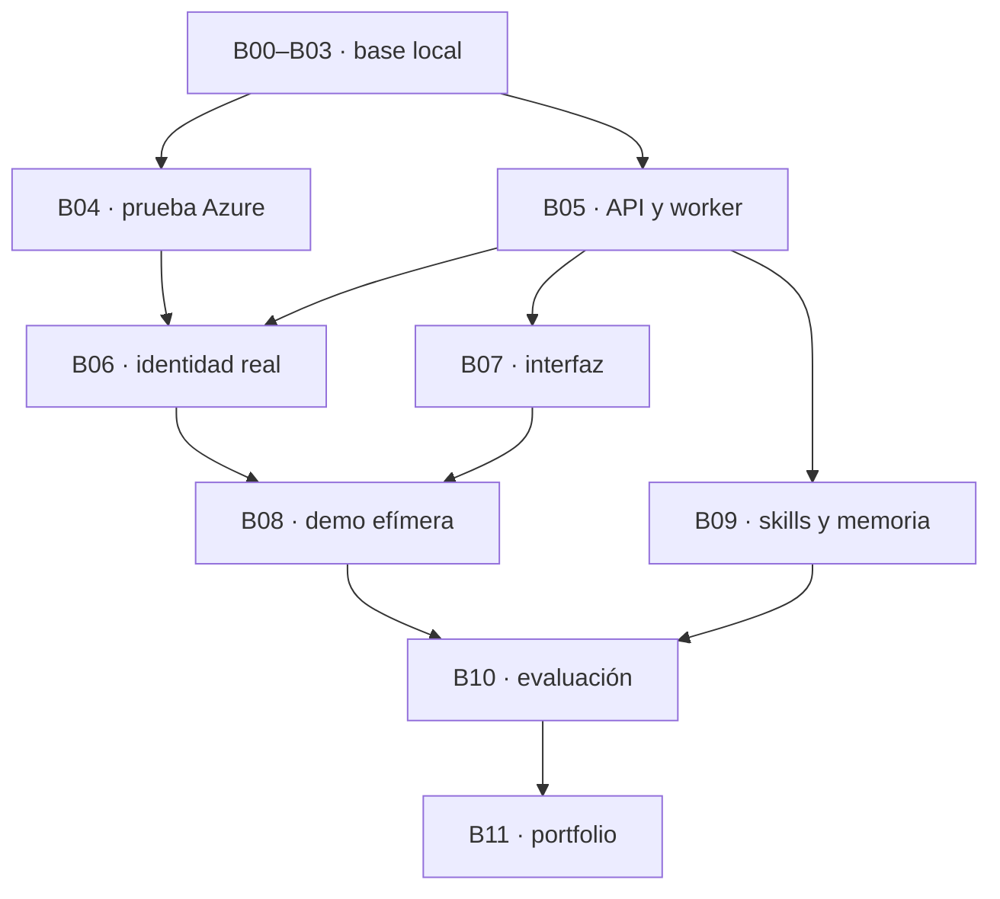

# Orden de desarrollo y mapa de bloques

El backlog contiene 12 bloques principales (B00–B11), con cuatro subbloques cada uno: 48 encargos. B12 añade cuatro subbloques opcionales de Microsoft Graph. El estado de cada encargo se mantiene en `docs/tasks/index.json`; completar documentación o una tarea no demuestra que el código de bloques posteriores esté implementado.

Ruta recomendada: B00, B01, B02, B03, B04, B05, B06, B07, B08, B09, B10 y B11. B12 solo después de cerrar el núcleo. Las dependencias mínimas permiten adelantar trabajo local si Azure está bloqueado.

| Bloque | Capacidad | Dependencias mínimas |
|---|---|---|
| B00 | Fundación del repositorio y contratos | Ninguna |
| B01 | PostgreSQL local y dataset reproducible | B00 |
| B02 | Dominio de compras y servidor MCP | B01 |
| B03 | Primer agente con pausa duradera | B02 |
| B04 | Prueba temprana de Azure e identidades | B03 |
| B05 | API y ejecución asíncrona resistente | B03 |
| B06 | Autenticación y autorización reales | B04, B05 |
| B07 | Interfaz mínima para enseñar el proceso | B05 |
| B08 | Demo Azure desplegable y eliminable | B06, B07 |
| B09 | Skills, memoria y subagentes útiles | B03, B05 |
| B10 | Evaluaciones, Langfuse y mejora controlada | B08, B09 |
| B11 | Entrega del portfolio y reproducción | B10 |
| B12 | Extensión opcional de Microsoft Graph | B11 |

## Hitos

- M0, B00: repositorio y contratos estables.
- M1, B03: compra local con MCP, evidencia, pregunta y reinicio.
- M2, B04 y B06: identidad real y límites de permiso demostrados.
- M3, B08: demo Azure reproducible con creación y retirada comprobadas.
- M4, B09–B10: subagentes, memoria y mejora de skill medida.
- M5, B11: portfolio documentado y reproducible.

No esperar a B10 para probar: cada subbloque trae su criterio y las trazas nacen en B03. La seguridad de dominio comienza en B02 y la identidad Azure se prueba antes de cerrar la plataforma. No esperar al final para implementar destroy: aparece en B04.

## Dependencias que permiten trabajo independiente

B09 puede adelantarse después de B05, aunque se recomienda cerrar antes la demo efímera para validar costes e identidad. Si se usan varios agentes, proteger los contratos compartidos y dar un responsable a las migraciones.

## Lectura mínima por tarea

AGENTS.md, PROJECT_CONTEXT.md, CONTRACTS.md, el archivo del bloque y los handoffs de sus dependencias. EXECUTION_GUIDE.md explica el encargo y la entrega. ARCHITECTURE_REFERENCE.md conserva las decisiones y fuentes de la planificación anterior.
